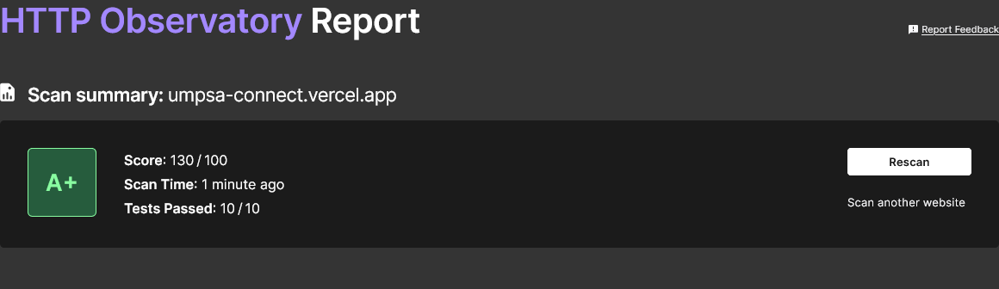
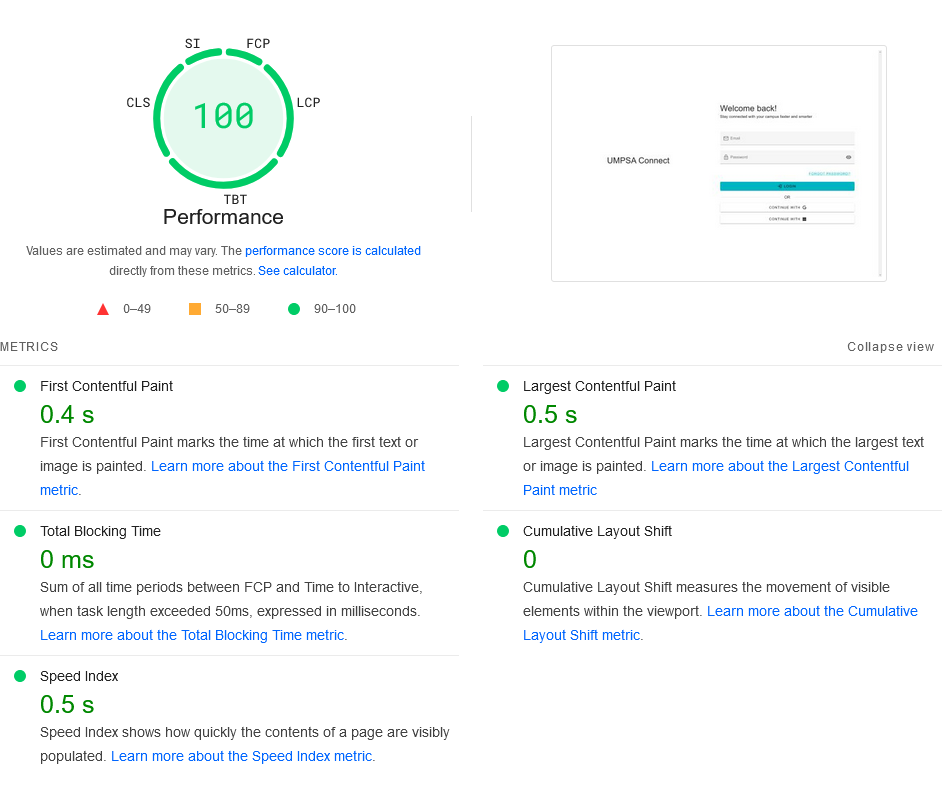

# UMPSA Connect

   

[UMPSA Connect](https://umpsa-connect.vercel.app/) is my final year project for my bachelor's degree at [University of Malaysia Pahang Al-Sultan Abdullah](https://www.umpsa.edu.my/en). It serves as a comprehensive solution to enhance communication, streamline information dissemination, foster engagement, and improve data security across the entire UMPSA community. By providing users with easy access to relevant information and facilitating seamless communication, the platform aims to create a more connected and informed campus environment.

## Technologies Used

    

## Web Security Test

UMPSA Connect has successfully passed all web security tests on the [Mozilla Developer Network HTTP Observatory](https://developer.mozilla.org/en-US/observatory). To verify the results, you can view the [HTTP Observatory Report](https://developer.mozilla.org/en-US/observatory/analyze?host=umpsa-connect.vercel.app).

## Web Performance Test

UMPSA Connect scored 100 on [Google PageSpeed Insights](https://pagespeed.web.dev/), with key metrics like a First Contentful Paint of 0.4 seconds, Largest Contentful Paint of 0.5 seconds, and a Cumulative Layout Shift of 0. For detailed results, view the [Full Analysis Report](https://pagespeed.web.dev/analysis/https-umpsa-connect-vercel-app/useednrfkh?form_factor=desktop).

## Progressive Web Application Support

UMPSA Connect is enhanced with Progressive Web App (PWA) capabilities, providing a more reliable and engaging user experience. With PWA support, users benefit from features like offline access, faster load times, and the ability to install the app directly on their devices.

### How to Install

**Desktop**: 

Visit [UMPSA Connect](https://umpsa-connect.vercel.app/) using a modern browser like Chrome or Edge. Click the "Install" button in the address bar to add the app to your desktop.

**Mobile**: 

Open [UMPSA Connect](https://umpsa-connect.vercel.app/) in your mobile browser. Tap the browser menu and select "Add to Home Screen" to install the app.